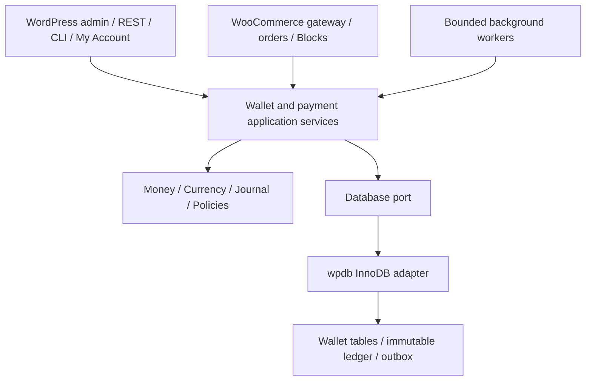

# Architecture

Modular monolith: WordPress/WooCommerce adapters → application use cases → immutable domain objects → ledger. Domain has no WordPress, WooCommerce, SQL, UI or network dependencies. Infrastructure implements a narrow database port. Application transactions coordinate ledger, lot provenance, holds, projections, audit, idempotency and outbox on one database connection.

Wallet accounts have one currency. A user can own several accounts; currencies never aggregate. A wallet/account is a lock boundary. Financial commands lock affected accounts in lexical ID order and execute under a database transaction. Business references and idempotency keys are independent uniqueness guards. Posted entries are insert-only through the application. SQL administration remains a trusted privileged boundary, monitored by reconciliation.

External side effects run after commit via an outbox. Event delivery is at least once; consumers must deduplicate event IDs. Network callbacks must resolve existing provider/order records and cannot nominate arbitrary credit amounts. No license/network request is required for spending, refunding or reconciling.

Separate responsibilities: database adapters/migrations; posting/idempotency; wallet credit and debit; credit-lot allocation; hold lifecycle; refunds; queries/reconciliation; storefront/administration; order integration.
